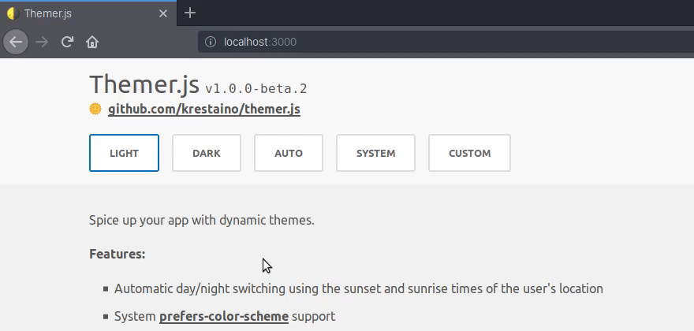

# Themer.js

Spice up your app with dynamic themes.



**Features:**

- Automatic day/night switching using the sunset and sunrise times of the user's location
- System [prefers-color-scheme](https://developer.mozilla.org/en-US/docs/Web/CSS/@media/prefers-color-scheme) support
- Android [meta theme-color](https://developers.google.com/web/updates/2014/11/Support-for-theme-color-in-Chrome-39-for-Android) support
- Custom themes
- Manual control over everything

## Demo

- [https://themer.js.kmr.io](https://themer.js.kmr.io)

## Examples

- **Vue:** [themer.js/examples/vue](https://github.com/krestaino/themer.js/tree/master/examples/vue)
- **React:** [themer.js/examples/react](https://github.com/krestaino/themer.js/tree/master/examples/react)
- **Svelte:** [themer.js/examples/svelte](https://github.com/krestaino/themer.js/tree/master/examples/svelte)

## <a name="quick-start"></a>Quick Start

### Install

```
# using yarn
$ yarn add themer.js

# using npm
$ npm install themer.js
```

### Define the `light` and `dark` themes

To use the `auto` or `system` themes, you must define a `light` and `dark` [Theme `object`](#theme).

```
import Themer, { auto, system } from "themer.js";

const light = {
  "styles": {
    "css": {
      "--app-background-color": "#f1f1f1",
      "--primary-text-color": "#555"
    }
  }
}

const dark = {
  "styles": {
    "css": {
      "--app-background-color": "#242835",
      "--primary-text-color": "#f1f1f1"
    }
  }
}

// instantiate Themer.js
const themer = new Themer({
  themes: { light, dark, auto, system }
});
```

### Setting a theme

```
import Themer, { auto, system } from "themer.js";
import { light, dark, auto, system } from "./themes/index.js";

const themer = new Themer({
  themes: { light, dark }
});

// set theme to dark
themer.set(dark);

// set theme to auto
themer.set(auto);

// set theme to system
themer.set(system);
```

### Setting a custom theme

Pass a valid [Theme `object`](#theme) to [Themer.set()](#set).

```
import Themer from "themer.js";

const custom = {
  "styles": {
    "css": {
      "--app-background-color": "#f1f1f1",
      "--primary-text-color": "#555"
    }
  }
};

const themer = new Themer();

themer.set(custom);
```

## <a name="api"></a>API

### <a name="themer"></a>Themer( config )

- **Arguments:**
  - `{Object} config`
- **Details:** Instantiate Themer.js.
- **Usage:**

  ```
  import Themer, { auto, system } from "themer.js";
  import { light, dark, custom } from "./themes/index.js";

  const config = {
    debug: true,
    onUpdate: (theme) => console.log(theme),
    themes: { light, dark, auto, system, custom }
  };

  const themer = new Themer(config);
  ```

- **See also:** [Config `object`](#config)

### <a name="set"></a>Themer.set( theme )

- **Arguments:**
  - `{Object} theme`
- **Details:** Sets the active theme.
- **Restrictions:**
  - **`auto|system`**: Both `light` and `dark` themes must be defined in the [Config `object`](#config).
  - **`auto`:** Requires user geolocation consent.
  - **`system`:** The browser must support [prefers-color-scheme](https://caniuse.com/#feat=prefers-color-scheme).
- **Usage:**

  ```
  const dark = {
    "styles": {
      "css": {
        "--app-background-color": "#242835"
      }
    }
  };

  Themer.set(dark);
  ```

- **See also:** [Theme `object`](#theme)

### <a name="themeSupportCheck"></a>Themer.themeSupportCheck()

- **Details:** Helper function to determine browser support for the `system` theme.
- **Returns:** `boolean`
- **Usage:**

  ```
  // Chrome 76, Firefox 67, Safari 12.1
  Themer.themeSupportCheck();
  ↳ true

  // unsupported browsers
  Themer.themeSupportCheck();
  ↳ false
  ```

- **See also:** [prefers-color-scheme](https://caniuse.com/#feat=prefers-color-scheme)

### <a name="config"></a>Config `object`

| Key        | Type       | Description                                                        |
| ---------- | ---------- | ------------------------------------------------------------------ |
| `debug`    | `boolean`  | Log debug console statements.                                      |
| `onUpdate` | `function` | A callback function that returns the set [Theme `object`](#theme). |
| `themes`   | `object`   | The available [Theme `object`](#theme)s.                           |

**Example:**

```
{
  debug: true,
  onUpdate: (theme) => console.log(theme),
  themes: { light, dark, auto, system, custom }
}
```

### <a name="theme"></a>Theme `object`

| Key      | Type            | Description                                                               |
| -------- | --------------- | ------------------------------------------------------------------------- |
| `styles` | `object|string` | A [Styles `object`](#styles) or `string` preset. (`"auto"` or `"system"`) |

**Examples:**

```
{
  "styles": {
    "android": "#f1f1f1",
    "css": {
      "--app-background-color": "#f1f1f1",
      "--primary-text-color": "#555"
    }
  }
}
```

```
{
  "styles": "auto"
}
```

### <a name="styles"></a>Styles `object`

The theme styles. Feel free to add more `key`/`value` pairs and use the `onUpdate` callback to get the active theme. You can use the active theme object in other parts of your application. For example, if you want to have different Google Maps themes for `light` and `dark` themes, you can add a new `key` to the [Styles `object`](#styles) called `googleMaps` and store the Google Maps style array there. This allows you to get the appropriate styles even when using `auto` and `system` themes.

| Key       | Type     | Description                                                                                                                      |
| --------- | -------- | -------------------------------------------------------------------------------------------------------------------------------- |
| `android` | `string` | Sets the [meta theme-color](https://developers.google.com/web/updates/2014/11/Support-for-theme-color-in-Chrome-39-for-Android). |
| `css`     | `object` | The theme CSS variables.                                                                                                         |

**Example:**

```
{
  "styles": {
    "android": "#f1f1f1",
    "css": {
      "--app-background-color": "#f1f1f1",
      "--primary-text-color": "#555"
    }
  }
}
```

### <a name="presets"></a>Preset Themes ( `auto|dark` )

To use `auto` and `system` themes, both a `light` and `dark` theme must be defined in the [Config `object`](#config)

- **Details:**
  - **`auto`:** Sets `light` during the day and `dark` during the night.
  - **`system`:** Sets to system theme preference. (`light`|`dark`)
- **Restrictions:**
  - **`auto|system`**: Both `light` and `dark` themes must be defined in the [Config `object`](#config).
  - **`auto`:** Requires user geolocation consent.
  - **`system`:** The browser must support [prefers-color-scheme](https://caniuse.com/#feat=prefers-color-scheme).

## CSS Variables

Use the CSS variables defined in your [Styles `object`](#styles) anywhere in your application and it will update in real time to the corresponding theme variable.

```
html {
  background-color: var(--app-background-color);
  color: var(--primary-text-color);
}
```
